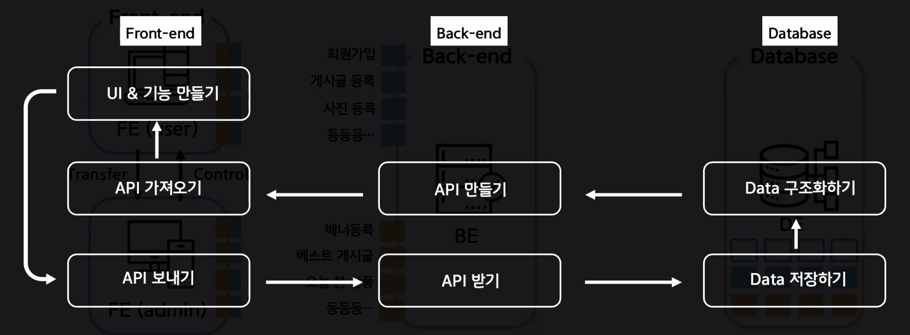

# 프리캠프
> 1주일동안 진행되는 사전교육

## OT
### 개발자의 자세
* 인내심 - Patience
* 검색능력 - Google Fu
* 열정 - Fassion

### 폴더 구조
| FOLDER        | DESCRIPTION      |
| :------------ | :--------------- |
| class         | 수업 실습 / 연습 |
| cyworld       | 과제             |
| cyworld-mento | 리뷰             |

### 기술 스택
|          |                          |
| -------- | ------------------------ |
| FrontEnd | HTML, CSS, JS, React.JS  |
| 통신     | Axios, REST API, GraphQL |
| BackEnd  | JS, Nest.JS              |
| 통신     | TypeORM                  |
| DB       | MongoDB, MySQL           |

### 웹앱 서비스 기본구조
> FrontEnd -(Request)-> BackEnd -> DB -> BackEnd -(Response)-> FrontEnd

